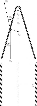

# Combustion Assignement

## 2025-2026 Turbomachinery Course

## Contact people

- Teacher: Sikke Klein, s.a.klein@tudelft.nl

- Teaching assistant (for this assignment): Rafael Pichler, r.pichler@tudelft.nl

## Submission

Submit your assignment as a PDF report to [r.pichler@tudelft.nl](mailto:r.pichler@tudelft.nl). The submission deadline is **Friday 09 January 2025, 23:59**. Submit one report per group, and submit your Python code along with the report. Name the files according to the following format (SN stands for student number): SN1_SURNAME1_Givenname1_SN2_SURNAME2_Givenname2.

## Preliminary preparations

Before starting the assignement, you need to install a Python distribution on your machine. You can do so by following the instructions given [here](./installation_instructions.md).

## Introduction

A key component of gas turbines is the combustor. In the combustor, the fuel and oxidiser (air) will be mixed and combusted to increase the enthalpy of the working fluid. Therefore, understanding the physics which govern combustion is essential for gas turbine design. This assignement aims to enhance your knowledge and understanding of combustion through the use of a 1-D flame simulation. The base code is provided with the questions. It contains a 1-D premixed flame simulation which computes the main flame parameters, such as the adiabatic flame temperature $T_{\mathrm{ad}}$ and the unstretched laminar flame speed $s_{l,0}$. The simulation also computes a series of mixture parameters, such as the kinematic viscosity of the unburnt mixture $\nu_u$.

Schematic of a one-dimensional premixed flame (Law, *Combustion Physics*, 2010).

---

In order to run the simulation, you will have to specify the following unburnt mixture parameters: the equivalence ratio $\phi$ and hydrogen volume fraction in the fuel $X_{\mathrm{H_2},f}$. The unburnt mixture temperature and pressure are set to default values $T_u=20$ °C and $p_u=1$ atm. The equivalence ratio is an important parameter in premixed combustion, which reflects how close a certain mixture is to stoichiometry. It is defined as

$$
\phi = \frac{n_f/n_o}{(n_f/n_o)_\mathrm{st}} = \frac{m_f/m_o}{(m_f/m_o)_\mathrm{st}},
$$

where $n$ and $m$ represent the quantity (mole) and mass, respectively, and the subscripts $f$, $o$ and $\mathrm{st}$ stand for fuel, oxidiser and stoichiometry, respectively. Thus, $\phi=1$ means that the mixture is at stoichiometric conditions, while $\phi<1$ and $\phi>1$ indicate fuel-lean and fuel-rich mixtures, respectively.

Throughout this assignment, it will be assumed, for simplicity, that natural gas is composed of pure methane ($\mathrm{CH_4}$). Hence, $X_{\mathrm{H_2},f}=0$ % means that the fuel is pure methane, while $X_{\mathrm{H_2},f}=100$ % means that it is pure hydrogen.

Air will always be used as an oxidiser, and it will be assumed that its composition (in volume fraction) is 79 % nitrogen and 21 % oxygen.

## Question 1

Depending on the lowest student number in your group, use the following equivalence ratios:

- Even number: $\phi_1=0.8$, $\phi_2=1$ and $\phi_3=1.15$

- Odd number: $\phi_1=0.9$, $\phi_2=1$ and $\phi_3=1.3$

Run the 1-D flame simulation for all three equivalence ratios, both using pure natural gas and pure hydrogen as a fuel (6 cases). 

Plot the adiabatic temperatures obtained for both fuels against the equivalence ratio. What do you observe? Comment on the effect of the equivalence ratio and the fuel composition. What does this mean in the context of a gas turbine combustor? What are  possible challenges caused by replacing natural gas by hydrogen in the fuel?

Plot the laminar flame speeds obtained for both fuels against the equivalence ratio. What do you observe? Comment on the effect of the equivalence ratio and the fuel composition. What does this mean in the context of a gas turbine combustor? What are possible challenges caused by replacing natural gas by hydrogen in the fuel?

## Question 2

Schematic of a premixed Bunsen flame (Law, *Combustion Physics*, 2010).

---

Let us now consider the case of a Bunsen burner. Assume that the Bunsen burner consists of a simple pipe of inner diameter $D=25$ mm, with the flame anchored at the burner rim. Also assume that fuel and oxidiser are homogeneously mixed upstream of the burner inlet, and that the flow inside the burner is incompressible and fully developed. The unburnt bulk velocity in the burner is $U_u=30$ m/s, and the integral length scale and integral eddy velocity (for turbulence) can be estimated as

$$
l_0 = \frac{D}{2} \quad \text{and} \quad u_0 = \frac{U_u}{20}.
$$

The Karlovitz number is a non-dimensional number which relates the laminar flame timescale $\tau_l$ to the Kolmogorov timescale of turbulent flow $\tau_\eta$. It is defined as

$$
\mathrm{Ka} = \frac{\tau_l}{\tau_\eta} = \left( \frac{u_\eta}{s_{l,0}} \right)^2,
$$

where $u_\eta$ is the Kolmogorov velocity.

Select one of the hydrogen-air mixtures of question 1 and compute the real flame speed. The flame speed can be estimated based on the flow conditions:

- If the flow is laminar,
  
  $$
  s=s_{l,0}.
  $$

- If the flow is turbulent and $\mathrm{Ka}<1$,

$$
s = s_t = s_{l,0}\, \sqrt{1 + \left( \frac{u_0}{s_{l,0}} \right)^2}.
$$

- If the flow is turbulent and $\mathrm{Ka}>1$,
  
  $$
  s = s_t = s_{l,0}\, \sqrt{\frac{u_0 l_0}{\nu_u}}.
  $$

Justify your reasoning behind the computation of the flame speed. Compare the obtained flame speed with the laminar flame speed from question 1. What do you observe? What are the implications for combustion in typical engineering flows?

## Question 3

In a burner, when the flame speed becomes equal to the flow velocity, the flame is able to move upstream. This phenomenon is called flame flashback. Using the information from question 2, compute the unburnt bulk velocity for which flashback occurs in the Bunsen burner $U_{u,fb}$.

Compare the result with the flame speed calculated in question 2. What do you notice? Is there any interaction between the flow and the flame? Now, think in terms of an actual gas turbine combustor. Does flashback pose any risks, and if so, which ones? Look back at the results of question 1. Do you expect a higher risk of flashback depending on the fuel composition?

## Authors

Rafael Pichler, Adam Zeman, Luuk Altenburg 

## License

Copyright (c) 2022-2025 Rafael Pichler, Adam Zeman, Luuk Altenburg

This program is free software: you can redistribute it and/or modify  it under the terms of the GNU General Public License as published by the Free Software Foundation, either version 3 of the License, or (at your option) any later version.

This program is distributed in the hope that it will be useful, but WITHOUT ANY WARRANTY; without even the implied warranty of MERCHANTABILITY or FITNESS FOR A PARTICULAR PURPOSE. See the GNU General Public License for more details.

You should have received a copy of the GNU General Public License along with this program. If not, see <https://www.gnu.org/licenses/>.

## Project status

Complete